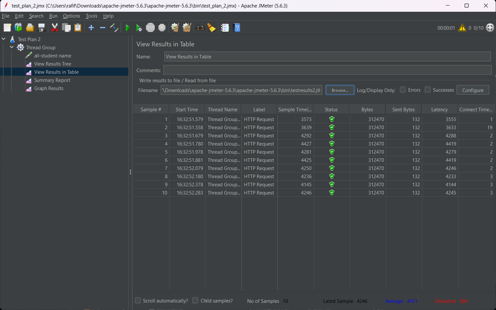
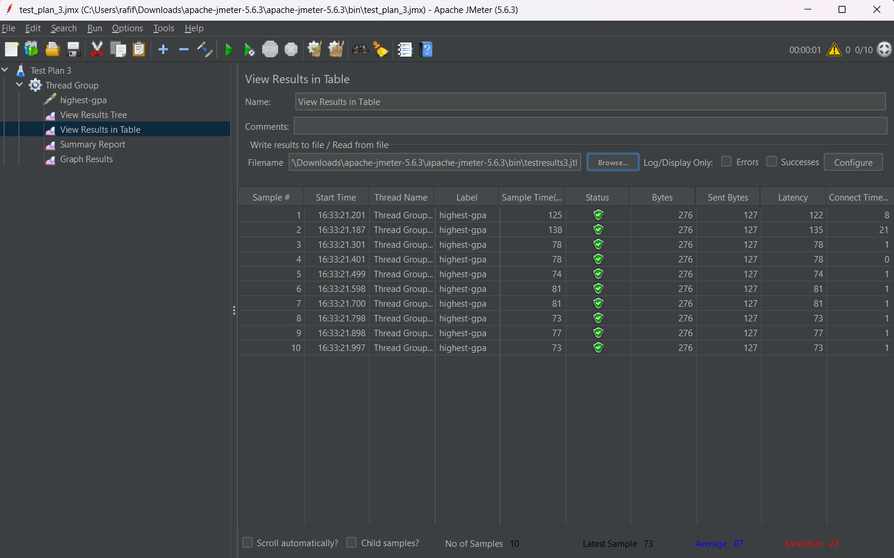
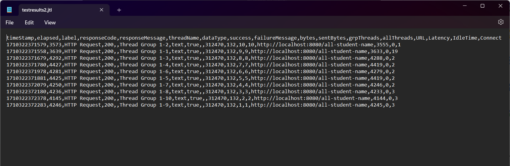
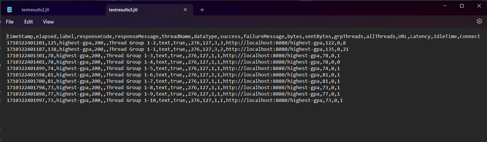

## Screenshots:

**/all-student-name**

**/highest-gpa**

**/all-student-name**

**/highest-gpa**

## Reflection:
#### 1. What is the difference between the approach of performance testing with JMeter and profiling with IntelliJ Profiler in the context of optimizing application performance?
    Answer:
    The differences in JMeter's testing of application performance under load 
    versus IntelliJ Profiler's analysis of application code performance. JMeter 
    simulates real-world scenarios, measuring response time and resource usage, 
    while IntelliJ Profiler identifies bottlenecks such as memory leaks and CPU 
    usage to optimize code performance.

#### 2. How does the profiling process help you in identifying and understanding the weak points in your application?
    Answer:
    The profiling process helps me in identifying and understanding the weak 
    points in my application by providing detailed information about the application's 
    performance, such as memory usage, CPU usage, and thread contention. By analyzing the 
    profiling results, I can identify the bottlenecks in the application code, such as 
    memory leaks, inefficient algorithms, and excessive object creation, and understand 
    the impact of these issues on the application's performance. This helps me in 
    identifying the weak points in the application and optimizing the code to improve 
    performance.

#### 3. Do you think IntelliJ Profiler is effective in assisting you to analyze and identify bottlenecks in your application code?
    Answer:
    Yes, I think IntelliJ Profiler effectively aids in analyzing and pinpointing 
    bottlenecks in my application code by furnishing detailed performance data like 
    memory and CPU usage, along with visual representations such as call trees and 
    flame graphs. These insights facilitate understanding the bottlenecks' impact 
    on performance and optimizing the code for improvement.

#### 4. What are the main challenges you face when conducting performance testing and profiling, and how do you overcome these challenges?
    Answer:
    Up to this point, the most significant hurdles have been locating the method in 
    the timeline menu within the profiler, navigating through numerous tabs during 
    testing and profiling, and enduring the completion of unoptimized code execution.

#### 5. What are the main benefits you gain from using IntelliJ Profiler for profiling your application code?
    Answer:
    The primary advantage I've gained from IntelliJ Profiler is the ability to 
    detect bottlenecks and enhance the performance of my methods.

#### 6. How do you handle situations where the results from profiling with IntelliJ Profiler are not entirely consistent with findings from performance testing using JMeter?
    Answer:
    When the results from profiling with IntelliJ Profiler are not entirely consistent
    with findings from performance testing using JMeter, I analyze the results from
    both tools to identify the root cause of the performance issues. I compare the
    profiling results with the performance testing results to understand the impact
    of the bottlenecks in the application code on the application's performance and
    optimize the code to improve performance.

#### 7. What strategies do you implement in optimizing application code after analyzing results from performance testing and profiling? How do you ensure the changes you make do not affect the application's functionality?
    Answer:
    Typically, I apply the concepts learned in my data structures and algorithms 
    course. If I find that a current data structure is inefficient, I either 
    implement or switch to a different one. Additionally, I utilize the profiler 
    to assess method performance and optimize them as needed before proceeding 
    with a new implementation.